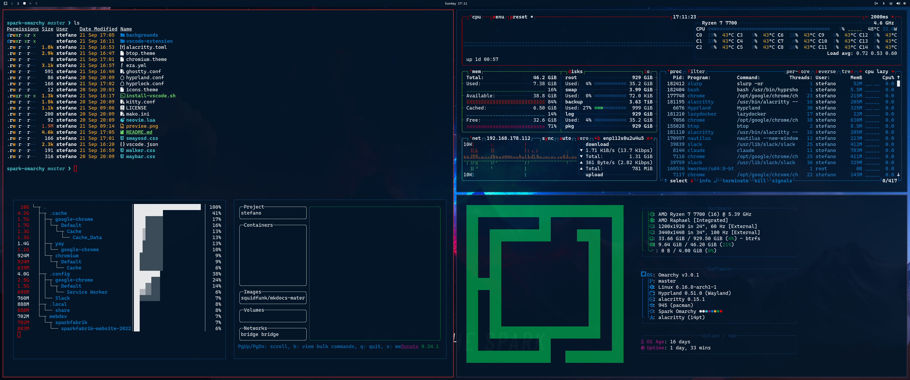

# Spark Omarchy Theme ⚡

A bold, corporate-inspired theme based on Sparkfabrik's design system — featuring vibrant reds and deep blues with professional contrast. Perfect for developers who want their desktop to reflect enterprise-grade design standards.



## Design Philosophy

- **Bold Corporate Identity**: Strong reds and blues that command attention
- **Professional Excellence**: Colors optimized for serious development work
- **High Contrast**: Perfect readability in all lighting conditions
- **Design System Consistency**: Every color carefully chosen from Sparkfabrik's palette

## Color DNA

### Primary Colors

Purpose | Hex | RGB | Name
--------|-----|-----|-----
Spark Red | `#EB0000` | rgb(235, 0, 0) | Primary Brand
Spark Blue | `#0C335A` | rgb(12, 51, 90) | Secondary Brand
Spark Black | `#031527` | rgb(3, 21, 39) | Deep Background
Spark White | `#FFFFFF` | rgb(255, 255, 255) | Pure Text

### Secondary Palette

Role | Hex | RGB | Description
-----|-----|-----|------------
Light Blue | `#027ACA` | rgb(2, 122, 202) | Links & Highlights
Aquamarine | `#40C6CF` | rgb(64, 198, 207) | Info Elements
Orange | `#F36931` | rgb(243, 105, 49) | Warnings
Yellow | `#F7AD2C` | rgb(247, 173, 44) | Attention
Dark Green | `#008844` | rgb(0, 136, 68) | Success States
Lime | `#68D366` | rgb(104, 211, 102) | Success Accents
Dark Purple | `#8D1971` | rgb(141, 25, 113) | Special Elements
Purple | `#CD0089` | rgb(205, 0, 137) | Highlights

## Themed Applications

- **Kitty Terminal**: Full Sparkfabrik color scheme with branded borders
- **Waybar**: Corporate color variables for professional status bar
- **Hyprland**: Bold red active borders with blue inactive states
- **Mako Notifications**: Branded notification styling
- **Neovim**: Dark theme optimized for the color palette
- **VS Code**: Professional development environment colors

## Installation

### Prerequisites
- Omarchy Linux
- chezmoi (for dotfiles management)

### Quick Install
```bash
# Clone the theme
git clone https://github.com/stefanomainardi/spark-omarchy-theme ~/.local/share/omarchy/themes/spark-omarchy

# Create symlink
ln -sf ~/.local/share/omarchy/themes/spark-omarchy ~/.config/omarchy/themes/spark-omarchy

# Apply theme (varies by Omarchy setup)
omarchy-theme spark-omarchy
```

### Manual Setup
```bash
# Copy theme files to your system
cp -r spark-omarchy/* ~/.local/share/omarchy/themes/spark-omarchy/

# Link individual configs as needed
ln -sf ~/.local/share/omarchy/themes/spark-omarchy/kitty.conf ~/.config/kitty/
ln -sf ~/.local/share/omarchy/themes/spark-omarchy/waybar.css ~/.config/waybar/

# Install VSCode extension (survives system updates)
./install-vscode.sh
```

### VSCode Extension

The theme includes a complete VSCode extension that survives system updates:

```bash
# Install VSCode extension manually
cd ~/.local/share/omarchy/themes/spark-omarchy
./install-vscode.sh

# The extension will appear in VSCode's theme dropdown as "Spark Omarchy"
# Or use Omarchy's automatic integration:
omarchy-theme-set spark-omarchy
```

**Post-Update Recovery**: If system updates remove the VSCode extension, simply run `./install-vscode.sh` again.

## Background Recommendations

- **Corporate Landscapes**: Professional cityscapes or modern architecture
- **Abstract Geometrics**: Clean patterns in Sparkfabrik colors
- **Minimalist Tech**: Circuit boards or data visualization aesthetics
- **Brand Elements**: Subtle Sparkfabrik logo patterns

**Pro Tip:** Use 4K wallpapers (3840x2160) for optimal display across all monitors.

## Contributing

Found a bug or want to improve the theme?

1. Fork this repository
2. Create your feature branch (`git checkout -b feature/amazing-improvement`)
3. Commit your changes (`git commit -m 'Add amazing improvement'`)
4. Push to the branch (`git push origin feature/amazing-improvement`)
5. Open a Pull Request

## About Sparkfabrik

This theme is inspired by [Sparkfabrik's](https://www.sparkfabrik.com/) corporate design system. Sparkfabrik is a leading digital innovation company specializing in enterprise web development and digital transformation.

## License

MIT License - feel free to modify and distribute!

## Credits

- **Theme Author**: Stefano Mainardi
- **Color System**: Based on Sparkfabrik Design System
- **Base Distribution**: Omarchy Linux
- **Inspiration**: Enterprise design meets developer productivity

---

⚡ **Spark your development environment!** ⚡